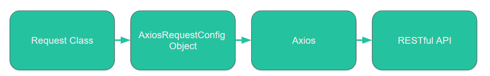

# jin-frame


[](https://npmcharts.com/compare/jin-frame?minimal=true)
[](https://github.com/imjuni/jin-frame)
[](https://github.com/imjuni/jin-frame/issues)
[](https://www.npmjs.com/package/jin-frame)
[](https://github.com/imjuni/jin-frame/blob/master/LICENSE)
[](https://github.com/imjuni/jin-frame/actions/workflows/ci.yml)
[](https://codecov.io/gh/imjuni/jin-frame)
[](https://github.com/prettier/prettier)

**HTTP Reqest** = **TypeScript Class**

`jin-frame` help to make HTTP Request `template` using by TypeScript class, decorator.

Why `jin-frame`?

1. decorator: decorator function make HTTP request parameter
2. Static Type Checking: **Compile-Time** static type checking on request parameter
3. HTTP Request can extends inheritance, OOP design
4. Use Axios EcoSystem

## Table of Contents <!-- omit in toc -->

- [How to works?](#how-to-works)
- [Comparison of direct usage and jin-frame](#comparison-of-direct-usage-and-jin-frame)
- [Install](#install)
- [Useage](#useage)
- [Requirements](#requirements)
- [Axios version](#axios-version)
- [Mocking](#mocking)
- [Form](#form)
  - [application/x-www-form-urlencoded](#applicationx-www-form-urlencoded)
  - [multipart/form-data](#multipartform-data)
- [Hook](#hook)
  - [Field for logging, debugging](#field-for-logging-debugging)
- [Example](#example)
- [License](#license)

## How to works?



## Comparison of direct usage and jin-frame

| Direct usage                     | Jin-Frame                               |
| -------------------------------- | --------------------------------------- |
|  |  |

## Install

```sh
npm i jin-frame --save
```

## Useage

Querystring made by `query`, `Q` decorator.

```ts
class IamReqest extends JinFrame {
  @JinFrame.Q()
  public readonly name!: string;
}
```

Path parameter made by `param`, `P` decorator and URI.

```ts
class IamReqest extends JinFrame {
  // decorator
  @JinFrame.P()
  public readonly id!: string;

  constructor(args: OmitConstructorType<IamReqest, JinBuiltInMember>) {
    // `:` character make path parameter on URI
    super({ ...args, host: 'http://some.api.google.com/jinframe/:id', method: 'post' });
  }
}
```

Header parameter made by `header`, `H` decorator and URI.

```ts
class IamReqest extends JinFrame {
  @JinFrame.H({ replaceAt: 'api-key' })
  public readonly apiKey!: string;
}
```

Body parameter made by `body`, `B` decorator and URI.

```ts
class IamReqest extends JinFrame {
  @JinFrame.B({ replaceAt: 'api-key' })
  public readonly gene!: string;
}
```

This is example of union param, body, header parameter.

```ts
class TestPostFrame extends JinFrame {
  @JinFrame.param()
  public readonly id!: number;

  @JinFrame.body({ replaceAt: 'test.hello.marvel.name' })
  public readonly name!: string;

  @JinFrame.header({ replaceAt: 'test.hello.marvel.skill' })
  public readonly skill!: string;

  // automatically initialize via base class, have to use same name of args and JinFrame class
  // execute `Object.keys(args).forEach(key => this[key] = args[key])`
  constructor(args: OmitConstructorType<TestPostFrame, JinBuiltInMember>) {
    super({ ...args, host: 'http://some.api.yanolja.com/jinframe/:id', method: 'POST' });
  }
}
```

TestPostFrame class create AxiosRequestConfig object below.

```ts
const frame = new TestPostFrame({ id: 1, name: 'ironman', skill: 'beam' });
console.log(frame.request());

// console.log show below,
{
  timeout: 2000,
  headers: { test: { hello: { marvel: { skill: 'beam' } } }, 'Content-Type': 'application/json' },
  method: 'POST',
  data: { test: { hello: { marvel: { name: 'ironman', gender: 'male' } } } },
  transformRequest: undefined,
  url: 'http://some.api.yanolja.com/jinframe/1',
  validateStatus: () => true
}
```

You can direct execute jin-frame. Curried request function create after execute it. jin-frame using axios library so using on browser.

```ts
const frame = new TestPostFrame({ id: 1, name: 'ironman', skill: 'beam' });
const res = await frame.execute();

// or
const resp = await axios.request(frame.request());
```

## Requirements

1. TypeScript
1. Decorator
   - enable experimentalDecorators, emitDecoratorMetadata option in `tsconfig.json`

## Axios version

| jin-frame | axios     |
| --------- | --------- |
| 2.x       | <= 0.27.x |
| 3.x       | >= 1.1.x  |

## Mocking

jin-frame use axios internally. So you can use [axios-mock-adapter](https://github.com/ctimmerm/axios-mock-adapter).

```ts
import axios from 'axios';
import MockAdapter from 'axios-mock-adpater';

// This sets the mock adapter on the default instance
const mock = new MockAdapter(axios);

// Mock any GET request to /users
// arguments for reply are (status, data, headers)
mock.onGet('/users').reply(200, {
  users: [{ id: 1, name: 'John Smith' }],
});

const frame = new UserFrame({ params: { searchText: 'John' } });
const reply = await frame.execute();

console.log(response.data);
```

## Form

The form data is `multipart/form-data` and `application/x-www-form-urlencoded`. Use to upload files or submit form fields data.

### application/x-www-form-urlencoded

`application/x-www-form-urlencoded` converts from data using the `trasformRequest` function in [axios](https://github.com/axios/axios). For jin-frame, if you set the `application/x-www-form-urlencoded` to content-type, use the built-in transformRequest function or pass transformRequest function to constructor.

### multipart/form-data

jin-frame uses the [form-data](https://github.com/form-data/form-data) package for form-data processing. If you set the `multipart/form-data` content-type, use the form-data package to generate the AxiosRequestConfig data field value. Alternatively, upload the file by passing the customBody constructor parameter.

## Hook

JinFrame support pre, post hook side of each request.

```ts
class TestPostFrame extends JinFrame {
  @JinFrame.param()
  public readonly id!: number;

  @JinFrame.body({ replaceAt: 'test.hello.marvel.name' })
  public readonly name!: string;

  @JinFrame.header({ replaceAt: 'test.hello.marvel.skill' })
  public readonly skill!: string;

  override preHook(req: AxiosRequestConfig<unknown>): void {
    console.log('pre hook executed');
  }

  override postHook(req: AxiosRequestConfig<unknown>): void {
    console.log('post hook executed');
  }

  // automatically initialize via base class, have to use same name of args and JinFrame class
  // execute `Object.keys(args).forEach(key => this[key] = args[key])`
  constructor(args: OmitConstructorType<TestPostFrame, JinBuiltInMember>) {
    super({ ...args, host: 'http://some.api.google.com/jinframe/:id', method: 'POST' });
  }
}

const frame = new TestPostFrame({ id: 1, name: 'ironman', skill: 'beam' });

// 'pre hook executed' display console
const res = await frame.execute();
// 'post hook executed' display console
```

### Field for logging, debugging

query, header, param, body getter function have each request parameter.

```ts
const frame = new TestPostFrame({ id: 1, name: 'ironman', skill: 'beam' });
// jin-frame build body, header, query, param variable
const res = await frame.execute();

// You can verify body, header, query parameter
console.log(frame.body);
console.log(frame.header);
console.log(frame.query);
console.log(frame.param);
```

## Example

You can find more examples in [examples directory](https://github.com/imjuni/jin-frame/tree/master/examples).

## License

This software is licensed under the [MIT](LICENSE).
