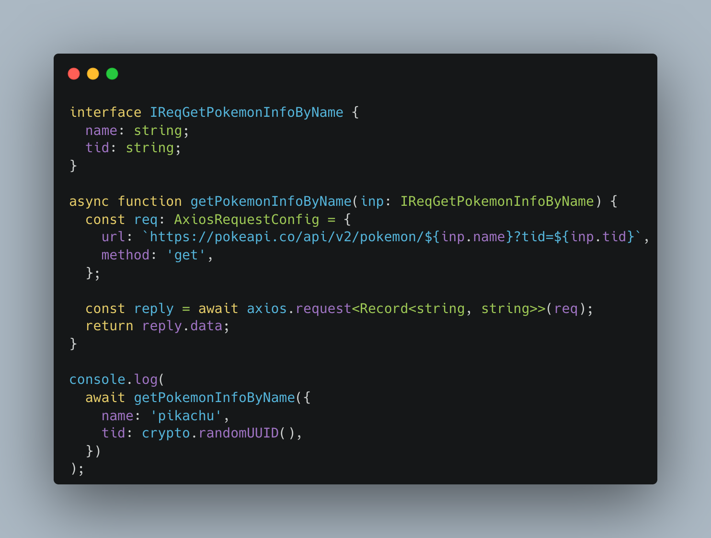

# What is jin-frame?

<!-- markdownlint-disable MD033 -->
<p align="center">
  
</p>
<!-- markdownlint-enable MD033 -->

**`jin-frame`** is a library that allows you to define **HTTP Requests** as **TypeScript Classes**.

It goes beyond simply defining requests by providing a variety of features frequently required in real-world applications. For example, you can configure hooks, set timeouts, and specify retry counts differently per endpoint. All of these configurations are expressed declaratively through TypeScript classes. The ultimate goal is to help you **manage APIs more effectively**.

## Why jin-frame?

- 🎩 **Declarative API Definition**  
  Define URL, Querystring, Path Param, Body, and Header clearly and intuitively using decorators and classes.

- ⛑️ **Type Safety**  
  Leverages TypeScript’s type system to catch mismatches at compile time.

- 🎢 **Production-Ready Features**  
  Backed by 290 test cases ensuring reliability, and equipped with features essential for MSA environments such as retry, hooks, file upload, and mocking.

- 🏭 **Axios Ecosystem**  
  Built on top of Axios, allowing you to take advantage of its stable ecosystem while extending its functionality.

- 🎪 **Path Parameter Support**  
  Safely replace path parameters like `example.com/:id` with strong typing guarantees.

## Features

- **Retry Configuration**  
  Flexible retry policies such as maximum attempts, fixed intervals, or exponential backoff.

- **Hook Support**  
  Define hooks before and after requests, or at retry timing. Hooks can be applied globally through inheritance or customized per endpoint.

- **Timeouts per Endpoint**  
  Apply different timeout values for each endpoint, useful in microservices environments.

- **File Upload**  
  Handle file uploads seamlessly with Axios under the same class-based request definitions.

- **Mocking Support**  
  Easily mock API responses for testing and development environments.

- **Extensibility**  
  Frame classes can be inherited, making it easy to extend configurations and build reusable components.

## Usage Example

Here’s a comparison between using Axios directly and using jin-frame:

| Direct usage                           | Jin-Frame                                     |
| -------------------------------------- | --------------------------------------------- |
|     |     |
| [axios svg](../assets/axios-usage.svg) | [jin-frame svg](../assets/jinframe-usage.svg) |

The amount of code is similar, but jin-frame makes it **clear which variables belong to Querystring, Header, Body, or Path Param**.  
Also, by using the static factory method `of`, you can create and execute requests in a type-safe way.

Additionally, you can configure timeouts and retry counts differently per endpoint. This is a common requirement when working with multiple API servers in an MSA environment, and jin-frame allows you to configure this declaratively.

```ts
@Get({
  host: 'https://pokeapi.co',
  path: '/api/v2/pokemon',
  timeout: 10_000, // 10 seconds
})
class PokemonPagingFrame extends JinFrame {
  @Query()
  declare readonly limit: number;

  @Query()
  declare readonly offset: number;
}

@Get({
  host: 'https://pokeapi.co',
  path: '/api/v2/pokemon/:name',
  timeout: 2_000, // 2 seconds
  retry: { max: 3, inteval: 1000 }, // retry up to 3 times, 1s interval
})
export class PokemonFrame extends JinFrame {
  @Param()
  declare public readonly name: string;

  @Query()
  declare public readonly tid: string;
}
```

These configurations can also be reused through inheritance, making it easy to extend for different use cases.

## Conclusion

**`jin-frame`** is not just a utility wrapper around Axios. It is a **type-safe, declarative, and extensible HTTP Request management library** designed to meet the needs of MSA environments.  

With jin-frame, developers can define API requests more clearly and systematically, gaining productivity in both maintenance and scalability.

Moreover, classes defined this way can be separated into a standalone package, allowing the **reuse of common API request logic across multiple projects**. This enables teams or organizations to share a consistent API calling pattern, ensuring both **consistency and reusability**.
