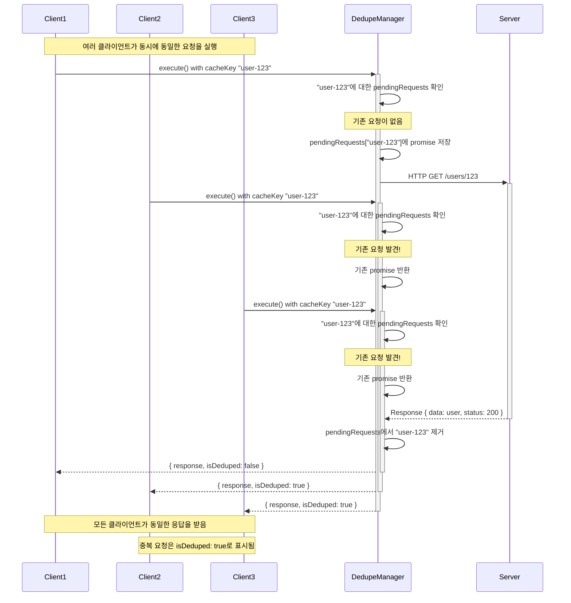

# 요청 중복 제거

**`@Dedupe`** 데코레이터는 동일한 HTTP 요청이 동시에 여러 번 발생할 때 중복 요청을 자동으로 제거하여 실제로는 하나의 HTTP 요청만 전송되도록 합니다.

## 개요

동일한 요청이 동시에 여러 번 실행될 때 (같은 엔드포인트, 같은 파라미터), dedupe 시스템은 실제로는 하나의 HTTP 요청만 전송되도록 보장합니다. 모든 중복 요청은 첫 번째 요청의 응답을 공유받습니다.

## 사용법

Frame 클래스에 `@Dedupe()` 데코레이터를 적용합니다:

```ts
import { JinFrame } from 'jin-frame';
import { Get, Dedupe } from 'jin-frame';

@Dedupe()
@Get({
  host: 'https://api.example.com',
  path: '/users/:id',
})
export class GetUserFrame extends JinFrame {
  @Param()
  declare readonly id: string;
}
```

## 동작 원리

중복 제거 시스템은 다음과 같이 작동합니다:

1. **캐시 키 생성**: 각 요청은 엔드포인트와 파라미터를 기반으로 고유한 캐시 키를 생성합니다
2. **요청 추적**: 진행 중인 요청들이 중앙 관리자에 의해 추적됩니다
3. **중복 탐지**: 중복 요청이 감지되면 원본 요청이 완료될 때까지 대기합니다
4. **응답 공유**: 모든 중복 요청은 원본 요청의 응답을 공유받습니다

### 시퀀스 다이어그램

다음 다이어그램은 동일한 요청이 동시에 여러 번 발생할 때 요청 중복 제거가 어떻게 작동하는지 보여줍니다:



## 예제 시나리오

```ts
@Dedupe()
@Get({
  host: 'https://api.example.com',
  path: '/users/:id',
})
export class GetUserFrame extends JinFrame {
  @Param()
  declare readonly id: string;
}

// 같은 사용자에 대한 동시 요청들
const promises = [
  GetUserFrame.of({ id: '123' }).execute(),
  GetUserFrame.of({ id: '123' }).execute(),
  GetUserFrame.of({ id: '123' }).execute(),
];

// /users/123에 대해 오직 하나의 HTTP 요청만 전송됩니다
// 세 개의 Promise 모두 같은 응답으로 resolve됩니다
const results = await Promise.all(promises);
```

## 응답 정보

dedupe를 사용할 때 응답이 중복 제거되었는지 확인할 수 있습니다:

```ts
const frame = GetUserFrame.of({ id: '123' });
const result = await frame.execute();

// 응답에는 중복 제거 정보가 포함됩니다
console.log(result.isDeduped); // 중복 요청인 경우 true
```

## 언제 사용해야 하는가

**권장하는 경우:**

- 읽기 전용 작업 (GET 요청)
- 자주 요청되는 비용이 많이 드는 API 호출
- 짧은 시간 내에 여러 번 실행될 수 있는 작업
- 같은 데이터를 여러 번 로드하는 대시보드나 분석 엔드포인트

**권장하지 않는 경우:**

- 쓰기 작업 (POST, PUT, PATCH, DELETE)
- 동일하더라도 항상 실행되어야 하는 요청
- 최신성이 중요한 시간에 민감한 요청

## 성능상 이점

- **네트워크 트래픽 감소**: 중복 HTTP 요청 제거
- **더 빠른 응답 시간**: 중복 요청은 캐시된 응답을 즉시 받음
- **서버 부하 감소**: 백엔드 서비스의 부하 감소
- **더 나은 사용자 경험**: 여러 동일한 요청으로 인한 UI 깜빡임 방지

## 캐시 키 커스터마이징

### 필드를 캐시 키에서 제외하기

때로는 특정 필드를 캐시 키 생성에서 제외해야 할 때가 있습니다. 이는 매 요청마다 변경되는 필드(UUID, 타임스탬프, 요청 ID 등)가 중복 제거에 영향을 주지 않아야 할 때 특히 중요합니다.

```ts
@Dedupe()
@Get({
  host: 'https://api.example.com',
  path: '/users/:id',
})
export class GetUserFrame extends JinFrame {
  @Param()
  declare readonly id: string;

  // 이 requestId는 매번 변경되지만 중복 제거에 영향을 주지 않아야 합니다
  @Query({ cacheKeyExclude: true })
  declare readonly requestId: string;

  @Header({ cacheKeyExclude: true })
  declare readonly tid: string;
}
```

### 중첩된 경로를 캐시 키에서 제외하기

복잡한 객체의 경우 특정 중첩 경로를 제외할 수 있습니다:

```ts
@Dedupe()
@Post({
  host: 'https://api.example.com',
  path: '/analytics',
})
export class AnalyticsFrame extends JinFrame {
  @Body({ cacheKeyExcludePaths: ['metadata.requestId', 'metadata.timestamp'] })
  declare readonly payload: {
    userId: string;
    action: string;
    metadata: {
      requestId: string;
      timestamp: number;
      sessionId: string;
    };
  };
}
```

### 사용 가능한 옵션

| 데코레이터 | 옵션                  | 타입       | 설명                                 |
| ---------- | --------------------- | ---------- | ------------------------------------ |
| Query      | `cacheKeyExclude`     | `boolean`  | 이 필드 전체를 캐시 키 생성에서 제외 |
| Param      | `cacheKeyExclude`     | `boolean`  | 이 필드 전체를 캐시 키 생성에서 제외 |
| Header     | `cacheKeyExclude`     | `boolean`  | 이 필드 전체를 캐시 키 생성에서 제외 |
| Body       | `cacheKeyExcludePaths` | `string[]` | 특정 중첩 경로를 캐시 키에서 제외    |
| ObjectBody | `cacheKeyExcludePaths` | `string[]` | 특정 중첩 경로를 캐시 키에서 제외    |

### 제외 옵션의 일반적인 사용 사례

**제외를 권장하는 필드:**

- `requestId`, `traceId`, `tid` - 요청 추적 식별자
- `timestamp`, `createdAt` - 매 요청마다 변경되는 시간 기반 필드
- `uuid`, `guid` - 매 요청마다 변경되는 고유 식별자
- `sessionToken` - 세션별 토큰
- `nonce` - 고유해야 하는 보안 논스

## 중요한 참고사항

- 중복 제거는 캐시 키 생성 후 **동일한 요청**에 대해서만 작동합니다
- `cacheKeyExclude: true`로 표시된 필드는 중복 제거에 영향을 주지 않습니다
- dedupe 캐시는 요청이 완료되면 (성공 또는 실패) 자동으로 정리됩니다
- 실패한 요청은 캐시되지 않습니다 - 각 요청은 독립적으로 재시도됩니다
- 중복 제거는 메모리 기반이며 애플리케이션 재시작 시 유지되지 않습니다

## 디버깅

내장된 유틸리티 메서드를 사용하여 중복 제거 동작을 모니터링할 수 있습니다:

```ts
import { RequestDedupeManager } from 'jin-frame';

// 대기 중인 요청 수 확인
console.log(RequestDedupeManager.getPendingRequestsCount());

// 특정 요청이 대기 중인지 확인
console.log(RequestDedupeManager.hasPendingRequest('cache-key'));

// 모든 대기 중인 요청 정리 (테스트용)
RequestDedupeManager.clearAllPendingRequests();
```
