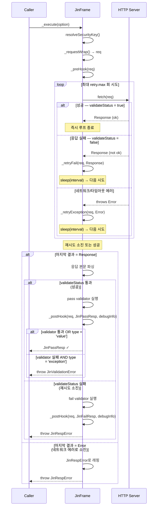

# Hooks

`JinFrame`은 HTTP 요청의 **직전**과 **직후**에 실행되는 두 가지 라이프사이클 훅을 제공합니다. 서브클래스에서 이를 오버라이드하면 로깅, 토큰 주입, 메트릭 수집 등의 횡단 관심사를 프레임의 핵심 요청 로직을 건드리지 않고 추가할 수 있습니다.

## \_preHook

HTTP 요청이 전송되기 직전에 실행됩니다. 완전히 구성된 `JinRequestConfig`를 받으므로 토큰 갱신 등 요청 직전 작업을 수행할 수 있습니다.

```ts
import { Get, JinFrame } from 'jin-frame';
import type { JinRequestConfig } from 'jin-frame';

@Get({ host: 'https://api.example.com', path: '/users/{id}' })
class GetUserFrame extends JinFrame<User> {
  @Param()
  declare public readonly id: string;

  protected override async _preHook(req: JinRequestConfig): Promise<void> {
    const token = await getAccessToken(); // 필요 시 토큰 갱신
    req.headers = { ...req.headers, Authorization: `Bearer ${token}` };
  }
}
```

### 시그니처

```ts
protected _preHook(req: JinRequestConfig): void | Promise<void>
```

| 파라미터 | 타입               | 설명                       |
| -------- | ------------------ | -------------------------- |
| `req`    | `JinRequestConfig` | 전송 직전의 요청 설정 객체  |

> `_preHook` 내에서 `req`를 변경하면 **실제 요청에 반영**됩니다.

---

## \_postHook

HTTP 응답 수신 후(성공·실패 모두)에 실행됩니다. 요청 설정, 판별 유니온 응답, 디버그 타이밍 정보를 받습니다.

```ts
import { Get, JinFrame } from 'jin-frame';
import type { JinRequestConfig, JinResp, DebugInfo } from 'jin-frame';

@Get({ host: 'https://api.example.com', path: '/users/{id}' })
class GetUserFrame extends JinFrame<User> {
  @Param()
  declare public readonly id: string;

  protected override _postHook(
    req: JinRequestConfig,
    reply: JinResp<User>,
    debug: DebugInfo,
  ): void {
    console.log(`[${reply.ok ? 'OK' : 'FAIL'}] ${req.url} — ${debug.duration}ms`);
  }
}
```

### 시그니처

```ts
protected _postHook(
  req: JinRequestConfig,
  reply: JinResp<Pass, Fail>,
  debugInfo: DebugInfo,
): void | Promise<void>
```

| 파라미터    | 타입                  | 설명                                       |
| ----------- | --------------------- | ------------------------------------------ |
| `req`       | `JinRequestConfig`    | 전송된 요청 설정                            |
| `reply`     | `JinResp<Pass, Fail>` | 판별 유니온 응답 (`ok: true \| false`)     |
| `debugInfo` | `DebugInfo`           | 타이밍 및 중복 제거 메타데이터              |

### DebugInfo

```ts
interface DebugInfo {
  ts: { unix: string; iso: string }; // 요청 시작 타임스탬프
  duration: number;                  // 전체 요청 소요 시간 (ms)
  isDeduped: boolean;                // 중복 제거 여부
  req: JinRequestConfig;             // 요청 설정 스냅샷
}
```

---

## \_retryFail

**HTTP 응답은 받았지만 상태 코드가 실패**인 경우(즉, `validateStatus`가 `false`를 반환) 각 시도 이후에 호출됩니다. 재시도가 소진되는 마지막 시도 후에도 한 번 더 호출됩니다.

이 훅은 재시도 횟수 로깅, 메트릭 업데이트, 일시적 장애 알림 등에 활용합니다.

```ts
import { Post, JinFrame } from 'jin-frame';
import type { JinRequestConfig } from 'jin-frame';

@Post({ host: 'https://api.example.com', path: '/submit', retry: { max: 3, interval: 500 } })
class SubmitFrame extends JinFrame<Result> {
  @Body()
  declare public readonly payload: string;

  protected override _retryFail(req: JinRequestConfig, res: Response): void {
    console.warn(`[retry-fail] ${req.url} → ${res.status} (시도 ${this._getData('retry')?.try}회)`);
  }
}
```

### 시그니처

```ts
protected _retryFail(req: JinRequestConfig, res: Response): void | Promise<void>
```

| 파라미터 | 타입               | 설명                                                  |
| -------- | ------------------ | ----------------------------------------------------- |
| `req`    | `JinRequestConfig` | 전송된 요청 설정                                       |
| `res`    | `Response`         | Response 객체의 복제본 (body를 안전하게 읽을 수 있음) |

> `_retryFail`은 재시도가 소진될 때가 아니라 **실패한 모든 시도마다** 호출됩니다. 최종 결과가 필요하다면 `_postHook`을 사용하세요.

---

## \_retryException

각 시도에서 **에러가 발생**한 경우(네트워크 단절, 타임아웃, 연결 거부 등) 호출됩니다. 마지막 시도에서도 에러가 발생하면 한 번 더 호출됩니다.

연결 문제 로깅이나 반복적 예외에 대한 알림 트리거에 활용합니다.

```ts
import { Post, JinFrame } from 'jin-frame';
import type { JinRequestConfig } from 'jin-frame';

@Post({ host: 'https://api.example.com', path: '/submit', retry: { max: 3, interval: 500 } })
class SubmitFrame extends JinFrame<Result> {
  @Body()
  declare public readonly payload: string;

  protected override _retryException(req: JinRequestConfig, err: Error): void {
    console.error(`[retry-exception] ${req.url} → ${err.message}`);
  }
}
```

### 시그니처

```ts
protected _retryException(req: JinRequestConfig, err: Error): void | Promise<void>
```

| 파라미터 | 타입               | 설명                           |
| -------- | ------------------ | ------------------------------ |
| `req`    | `JinRequestConfig` | 전송된 요청 설정               |
| `err`    | `Error`            | fetch 시도 중 발생한 에러 객체 |

> `_retryException`도 마지막 에러 포함, **에러가 발생한 모든 시도마다** 호출됩니다. 최종 결과가 필요하다면 `_postHook`을 사용하세요.

---

## 훅 실행 흐름

아래 다이어그램은 전체 요청 라이프사이클에서 각 훅이 언제 호출되는지를 보여줍니다.



### 훅 요약

| 훅                  | 호출 시점                   | 호출 횟수 | 주요 용도                              |
| ------------------- | --------------------------- | --------- | -------------------------------------- |
| `_preHook`          | 재시도 루프 시작 전          | 1회       | 토큰 주입, 요청 로깅                   |
| `_retryFail`        | 응답 실패한 각 시도 후       | 0 – N회   | 재시도 로깅, 일시적 오류 메트릭        |
| `_retryException`   | 네트워크 에러가 발생한 각 시도 후 | 0 – N회 | 연결 문제 알림, 에러 로깅              |
| `_postHook`         | 재시도 루프 종료 후          | 1회       | 응답 로깅, 메트릭 기록, 캐시 무효화   |

---

## 공유 베이스 프레임 패턴

훅은 상속과 함께 사용할 때 특히 강력합니다. 베이스 프레임에 훅을 한 번만 정의하면 모든 서브클래스가 자동으로 동일한 동작을 갖습니다.

```ts
import { JinFrame } from 'jin-frame';
import type { JinRequestConfig, JinResp, DebugInfo } from 'jin-frame';

abstract class ApiBase<Pass, Fail = Pass> extends JinFrame<Pass, Fail> {
  protected override async _preHook(req: JinRequestConfig): Promise<void> {
    const token = await tokenStore.get();
    req.headers = { ...req.headers, Authorization: `Bearer ${token}` };
  }

  protected override _postHook(
    req: JinRequestConfig,
    reply: JinResp<Pass, Fail>,
    debug: DebugInfo,
  ): void {
    metrics.record({ url: req.url, status: reply.status, duration: debug.duration });
  }
}

@Get({ host: 'https://api.example.com', path: '/users/{id}' })
class GetUserFrame extends ApiBase<User> {
  @Param()
  declare public readonly id: string;
}

@Post({ host: 'https://api.example.com', path: '/users' })
class CreateUserFrame extends ApiBase<User> {
  @Body()
  declare public readonly name: string;
}
```

---

## 주요 활용 사례

| 활용 사례               | 훅                  | 예시                                              |
| ----------------------- | ------------------- | ------------------------------------------------- |
| 토큰 주입 / 갱신        | `_preHook`          | 요청 전 `Authorization` 헤더 첨부                 |
| 요청 로깅               | `_preHook`          | 발신 URL과 메서드 로깅                             |
| 재시도 시도 로깅        | `_retryFail`        | 실패 시 상태 코드와 재시도 횟수 로깅               |
| 네트워크 에러 로깅      | `_retryException`   | 네트워크 에러 메시지 로깅                          |
| 최종 응답 로깅          | `_postHook`         | 최종 상태 코드와 지연 시간 로깅                    |
| 메트릭 / 트레이싱       | `_postHook`         | 메트릭 수집기에 소요 시간 기록                     |
| 오류 알림               | `_postHook`         | `reply.ok === false` 시 알림 발송                  |
| 캐시 무효화             | `_postHook`         | 성공적인 변경 요청 후 캐시 삭제                    |
