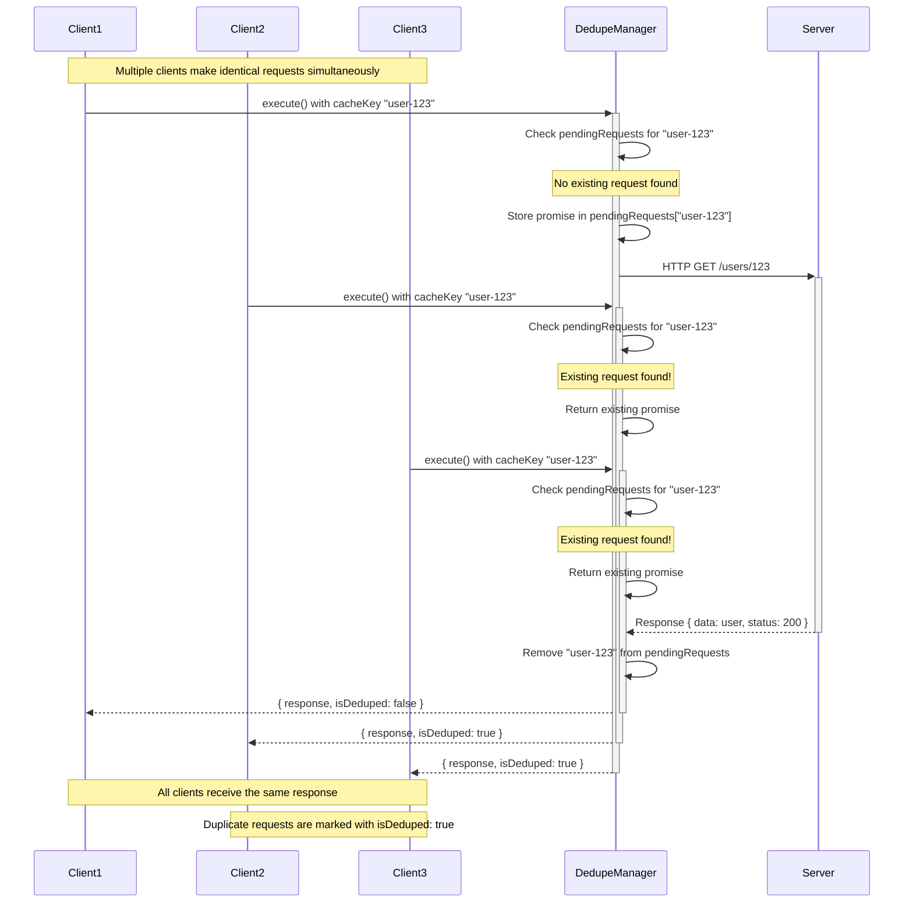

# Request Deduplication

**`@Dedupe`** decorator provides automatic request deduplication to prevent duplicate HTTP requests from being sent when multiple identical requests are made simultaneously.

## Overview

When multiple identical requests are triggered at the same time (same endpoint, same parameters), the dedupe system ensures only one actual HTTP request is made. All duplicate requests will receive the same response from the first request.

## Usage

Apply the `@Dedupe()` decorator to your frame class:

```ts
import { JinFrame } from 'jin-frame';
import { Get, Dedupe } from 'jin-frame';

@Dedupe()
@Get({
  host: 'https://api.example.com',
  path: '/users/:id',
})
export class GetUserFrame extends JinFrame {
  @Param()
  declare readonly id: string;
}
```

## How It Works

The deduplication system works by:

1. **Cache Key Generation**: Each request generates a unique cache key based on the endpoint and parameters
2. **Request Tracking**: Ongoing requests are tracked in a central manager
3. **Duplicate Detection**: When a duplicate request is detected, it waits for the original request to complete
4. **Response Sharing**: All duplicate requests receive the same response from the original request

### Sequence Diagram

The following diagram illustrates how request deduplication works when multiple identical requests are made simultaneously:



## Example Scenario

```ts
@Dedupe()
@Get({
  host: 'https://api.example.com',
  path: '/users/:id',
})
export class GetUserFrame extends JinFrame {
  @Param()
  declare readonly id: string;
}

// Multiple simultaneous requests for the same user
const promises = [
  GetUserFrame.of({ id: '123' }).execute(),
  GetUserFrame.of({ id: '123' }).execute(),
  GetUserFrame.of({ id: '123' }).execute(),
];

// Only ONE HTTP request will be made to /users/123
// All three promises will resolve with the same response
const results = await Promise.all(promises);
```

## Response Information

When using dedupe, you can check if a response was deduplicated:

```ts
const frame = GetUserFrame.of({ id: '123' });
const result = await frame.execute();

// The response includes deduplication information
console.log(result.isDeduped); // true if this was a duplicate request
```

## When to Use Dedupe

**Recommended for:**

- Read-only operations (GET requests)
- Expensive API calls that are frequently requested
- Operations that might be triggered multiple times in rapid succession
- Dashboard or analytics endpoints that load the same data multiple times

**Not recommended for:**

- Write operations (POST, PUT, PATCH, DELETE)
- Requests that should always be executed (even if identical)
- Time-sensitive requests where staleness is a concern

## Performance Benefits

- **Reduced Network Traffic**: Eliminates redundant HTTP requests
- **Faster Response Times**: Duplicate requests receive cached responses immediately
- **Server Load Reduction**: Decreases load on backend services
- **Better User Experience**: Prevents UI flickering from multiple identical requests

## Cache Key Customization

### Excluding Fields from Cache Key

Sometimes you need to exclude certain fields from the cache key generation. This is especially important for fields that change on every request (like UUIDs, timestamps, or request IDs) but shouldn't affect deduplication.

```ts
@Dedupe()
@Get({
  host: 'https://api.example.com',
  path: '/users/:id',
})
export class GetUserFrame extends JinFrame {
  @Param()
  declare readonly id: string;

  // This requestId changes every time but shouldn't affect deduplication
  @Query({ cacheKeyExclude: true })
  declare readonly requestId: string;

  @Header({ cacheKeyExclude: true })
  declare readonly tid: string;
}
```

### Excluding Nested Paths from Cache Key

For complex objects, you can exclude specific nested paths:

```ts
@Dedupe()
@Post({
  host: 'https://api.example.com',
  path: '/analytics',
})
export class AnalyticsFrame extends JinFrame {
  @Body({ cacheKeyExcludePaths: ['metadata.requestId', 'metadata.timestamp'] })
  declare readonly payload: {
    userId: string;
    action: string;
    metadata: {
      requestId: string;
      timestamp: number;
      sessionId: string;
    };
  };
}
```

### Available Options

| Decorator  | Option                | Type       | Description                                         |
| ---------- | --------------------- | ---------- | --------------------------------------------------- |
| Query      | `cacheKeyExclude`     | `boolean`  | Exclude this entire field from cache key generation |
| Param      | `cacheKeyExclude`     | `boolean`  | Exclude this entire field from cache key generation |
| Header     | `cacheKeyExclude`     | `boolean`  | Exclude this entire field from cache key generation |
| Body       | `cacheKeyExcludePaths` | `string[]` | Exclude specific nested paths from cache key        |
| ObjectBody | `cacheKeyExcludePaths` | `string[]` | Exclude specific nested paths from cache key        |

### Common Use Cases for Exclusion

**Recommended fields to exclude:**

- `requestId`, `traceId`, `tid` - Request tracking identifiers
- `timestamp`, `createdAt` - Time-based fields that change every request
- `uuid`, `guid` - Unique identifiers that change per request
- `sessionToken` - Session-specific tokens
- `nonce` - Security nonces that must be unique

## Important Notes

- Deduplication only works for **identical requests** after cache key generation
- Fields marked with `cacheKeyExclude: true` won't affect deduplication
- The dedupe cache is automatically cleared when requests complete (success or failure)
- Failed requests are not cached - each request will retry independently
- Deduplication is memory-based and does not persist across application restarts

## Debugging

You can monitor deduplication behavior using the built-in utility methods:

```ts
import { RequestDedupeManager } from 'jin-frame';

// Check number of pending requests
console.log(RequestDedupeManager.getPendingRequestsCount());

// Check if a specific request is pending
console.log(RequestDedupeManager.hasPendingRequest('cache-key'));

// Clear all pending requests (for testing)
RequestDedupeManager.clearAllPendingRequests();
```
