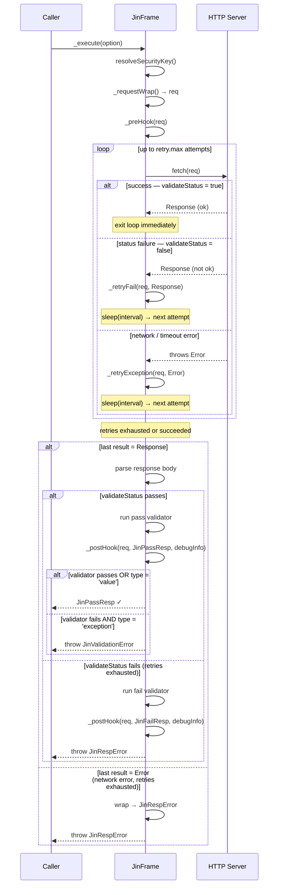

# Hooks

`JinFrame` provides two lifecycle hooks that run **before** and **after** each HTTP request. Override them in a subclass to add logging, token injection, metrics, or any cross-cutting concern without modifying the frame's core request logic.

## \_preHook

Runs just before the HTTP request is dispatched. Receives the fully-built `JinRequestConfig` so you can inspect or mutate it (for example, to inject a fresh token).

```ts
import { Get, JinFrame } from 'jin-frame';
import type { JinRequestConfig } from 'jin-frame';

@Get({ host: 'https://api.example.com', path: '/users/{id}' })
class GetUserFrame extends JinFrame<User> {
  @Param()
  declare public readonly id: string;

  protected override async _preHook(req: JinRequestConfig): Promise<void> {
    const token = await getAccessToken(); // e.g. refresh if expired
    req.headers = { ...req.headers, Authorization: `Bearer ${token}` };
  }
}
```

### Signature

```ts
protected _preHook(req: JinRequestConfig): void | Promise<void>
```

| Parameter | Type               | Description                        |
| --------- | ------------------ | ---------------------------------- |
| `req`     | `JinRequestConfig` | The request config about to be sent |

> Mutating `req` inside `_preHook` **does** affect the outgoing request.

---

## \_postHook

Runs after the HTTP response is received (whether pass or fail). Receives the request config, the discriminated-union response, and debug timing info.

```ts
import { Get, JinFrame } from 'jin-frame';
import type { JinRequestConfig, JinResp, DebugInfo } from 'jin-frame';

@Get({ host: 'https://api.example.com', path: '/users/{id}' })
class GetUserFrame extends JinFrame<User> {
  @Param()
  declare public readonly id: string;

  protected override _postHook(
    req: JinRequestConfig,
    reply: JinResp<User>,
    debug: DebugInfo,
  ): void {
    console.log(`[${reply.ok ? 'OK' : 'FAIL'}] ${req.url} — ${debug.duration}ms`);
  }
}
```

### Signature

```ts
protected _postHook(
  req: JinRequestConfig,
  reply: JinResp<Pass, Fail>,
  debugInfo: DebugInfo,
): void | Promise<void>
```

| Parameter   | Type                    | Description                            |
| ----------- | ----------------------- | -------------------------------------- |
| `req`       | `JinRequestConfig`      | The request config that was sent       |
| `reply`     | `JinResp<Pass, Fail>`   | Discriminated-union response (`ok: true \| false`) |
| `debugInfo` | `DebugInfo`             | Timing and deduplication metadata      |

### DebugInfo

```ts
interface DebugInfo {
  ts: { unix: string; iso: string }; // Request start timestamp
  duration: number;                  // Total request duration in ms
  isDeduped: boolean;                // Whether this response was deduplicated
  req: JinRequestConfig;             // Request config snapshot
}
```

---

## \_retryFail

Called after each attempt that receives a **non-success HTTP response** (i.e. `validateStatus` returns `false`). Fires once per failed attempt, including the last one before retries are exhausted.

Use this hook to log retry attempts, update metrics, or notify an external system about transient failures.

```ts
import { Post, JinFrame } from 'jin-frame';
import type { JinRequestConfig } from 'jin-frame';

@Post({ host: 'https://api.example.com', path: '/submit', retry: { max: 3, interval: 500 } })
class SubmitFrame extends JinFrame<Result> {
  @Body()
  declare public readonly payload: string;

  protected override _retryFail(req: JinRequestConfig, res: Response): void {
    console.warn(`[retry-fail] ${req.url} → ${res.status} (attempt ${this._getData('retry')?.try})`);
  }
}
```

### Signature

```ts
protected _retryFail(req: JinRequestConfig, res: Response): void | Promise<void>
```

| Parameter | Type               | Description                                              |
| --------- | ------------------ | -------------------------------------------------------- |
| `req`     | `JinRequestConfig` | The request config that was sent                         |
| `res`     | `Response`         | A clone of the Response object (body can be read safely) |

> `_retryFail` fires for **every** failed attempt, not only when retries are exhausted. Use `_postHook` if you need the final result.

---

## \_retryException

Called after each attempt that **throws an error** (network down, timeout, connection refused, etc.). Fires once per error attempt, including the last one.

Use this hook to log connectivity problems or trigger alerting on repeated exceptions.

```ts
import { Post, JinFrame } from 'jin-frame';
import type { JinRequestConfig } from 'jin-frame';

@Post({ host: 'https://api.example.com', path: '/submit', retry: { max: 3, interval: 500 } })
class SubmitFrame extends JinFrame<Result> {
  @Body()
  declare public readonly payload: string;

  protected override _retryException(req: JinRequestConfig, err: Error): void {
    console.error(`[retry-exception] ${req.url} → ${err.message}`);
  }
}
```

### Signature

```ts
protected _retryException(req: JinRequestConfig, err: Error): void | Promise<void>
```

| Parameter | Type               | Description                              |
| --------- | ------------------ | ---------------------------------------- |
| `req`     | `JinRequestConfig` | The request config that was sent         |
| `err`     | `Error`            | The error thrown during the fetch attempt |

> `_retryException` fires on every network-level error, including the final one. Use `_postHook` if you need the definitive outcome.

---

## Hook Execution Flow

The diagram below shows when each hook fires relative to the overall request lifecycle.



### Hook summary

| Hook               | Fires                    | Times     | Typical use                             |
| ------------------ | ------------------------ | --------- | --------------------------------------- |
| `_preHook`         | Before the retry loop    | Once      | Token injection, request logging        |
| `_retryFail`       | Each bad-status attempt  | 0 – N     | Retry logging, transient-error metrics  |
| `_retryException`  | Each network-error attempt | 0 – N   | Connectivity alerting, error logging    |
| `_postHook`        | After the retry loop     | Once      | Response logging, metrics, cache bust   |

---

## Shared Base Frame Pattern

The hooks pattern is especially useful when combined with inheritance. Define hooks once in a base frame and all subclasses inherit the behaviour automatically.

```ts
import { JinFrame } from 'jin-frame';
import type { JinRequestConfig, JinResp, DebugInfo } from 'jin-frame';

abstract class ApiBase<Pass, Fail = Pass> extends JinFrame<Pass, Fail> {
  protected override async _preHook(req: JinRequestConfig): Promise<void> {
    const token = await tokenStore.get();
    req.headers = { ...req.headers, Authorization: `Bearer ${token}` };
  }

  protected override _postHook(
    req: JinRequestConfig,
    reply: JinResp<Pass, Fail>,
    debug: DebugInfo,
  ): void {
    metrics.record({ url: req.url, status: reply.status, duration: debug.duration });
  }
}

@Get({ host: 'https://api.example.com', path: '/users/{id}' })
class GetUserFrame extends ApiBase<User> {
  @Param()
  declare public readonly id: string;
}

@Post({ host: 'https://api.example.com', path: '/users' })
class CreateUserFrame extends ApiBase<User> {
  @Body()
  declare public readonly name: string;
}
```

---

## Common Use Cases

| Use Case                     | Hook                | Example                                             |
| ---------------------------- | ------------------- | --------------------------------------------------- |
| Token injection / refresh    | `_preHook`          | Attach `Authorization` header before each request   |
| Request logging              | `_preHook`          | Log the outgoing URL and method                     |
| Retry attempt logging        | `_retryFail`        | Log status code and retry count on each failure     |
| Connectivity error logging   | `_retryException`   | Log network error message on each exception         |
| Response logging             | `_postHook`         | Log final status code and latency                   |
| Metrics / tracing            | `_postHook`         | Record duration in a metrics collector              |
| Error alerting               | `_postHook`         | Send alert when `reply.ok === false`                |
| Cache invalidation           | `_postHook`         | Bust a cache after a successful mutation            |
